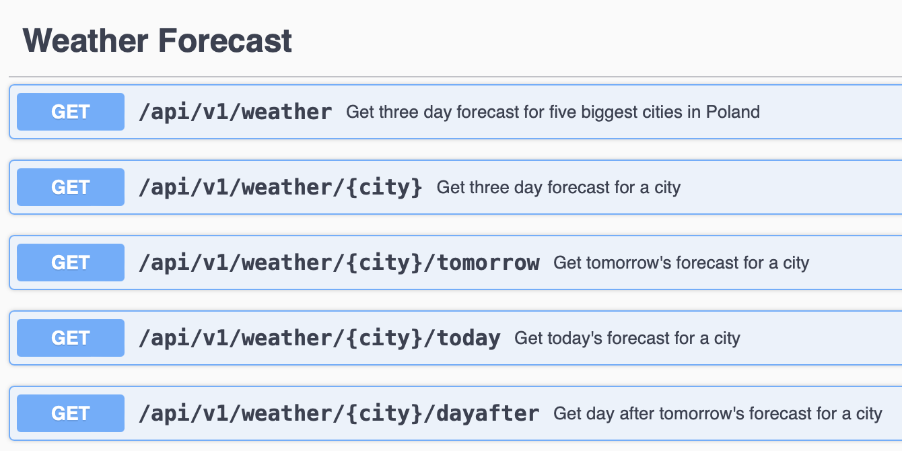
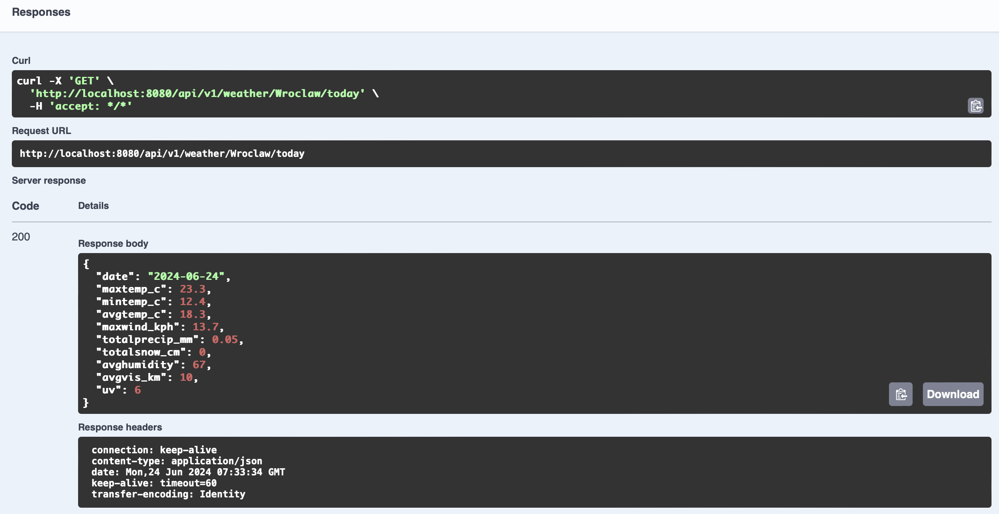
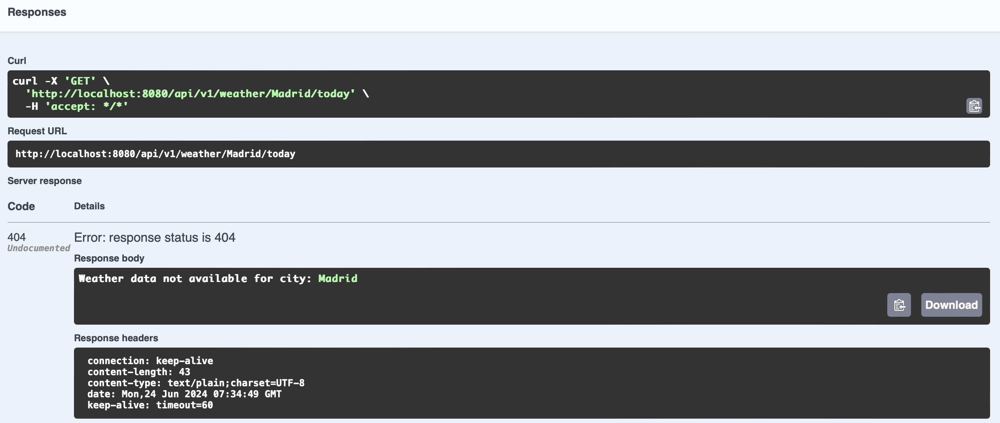

# Forecast App 🌤

---

### 🌦 Description & Functionality:

#### The Forecast App provides detailed weather forecasts for the next three days for the five biggest cities in Poland: Wroclaw, Cracow, Lodz, Warsaw, and Poznan. Users can access information such as maximum and minimum temperatures, average temperature, maximum wind speed, total precipitation, total snowfall, average humidity, average visibility, and UV index.

### 🌧 Technologies:
- Backend: Java 21, Spring Boot
- Configuration: Git, Maven, Docker, Continuous Integration (GitHub Actions), WeatherAPI
- Testing: JUnit 5, Mockito
- API Documentation: OpenAPI - Swagger UI
- HTTP Client: WebClient

### ⚡ How to Run This App?

#### 1. Clone this repository:
`https://github.com/patryk47853/Forecast.git`

#### 2. Go to `src/main/resources/application.properties` and add your WeatherAPI key (to create one, visit: `https://www.weatherapi.com`)

#### 3. Run the `ForecastApplication` class and go to URL `http://localhost:8080/swagger-ui.html` to access the Swagger UI and explore the available endpoints.

---

## ⛄ Running Service

#### Home Page (Swagger UI)

#### Weather Properties (Status Code: 200 OK)

#### Invalid Input Screen (Status Code: 404 Error)

---

## 🌐 API Endpoints

| HTTP Method | Endpoint                  | Description                                                                 |
|-------------|---------------------------|-----------------------------------------------------------------------------|
| GET         | `/api/v1/weather`         | Get three-day forecast for the five biggest cities in Poland (Wroclaw, Cracow, Lodz, Warsaw, Poznan) |
| GET         | `/api/v1/weather/{city}`  | Get three-day weather forecast for a specified city (available cities: Wroclaw, Cracow, Lodz, Warsaw, Poznan) |
| GET         | `/api/v1/weather/{city}/today` | Get today's weather forecast for a specified city (available cities: Wroclaw, Cracow, Lodz, Warsaw, Poznan) |
| GET         | `/api/v1/weather/{city}/tomorrow` | Get tomorrow's weather forecast for a specified city (available cities: Wroclaw, Cracow, Lodz, Warsaw, Poznan) |
| GET         | `/api/v1/weather/{city}/dayafter` | Get the day after tomorrow's weather forecast for a specified city (available cities: Wroclaw, Cracow, Lodz, Warsaw, Poznan) |

This setup allows users to get detailed weather forecasts for five biggest cities in Poland, leveraging a modern tech stack for robust performance and ease of use. The use of Swagger UI ensures the API is easily explorable and testable directly from the browser.
